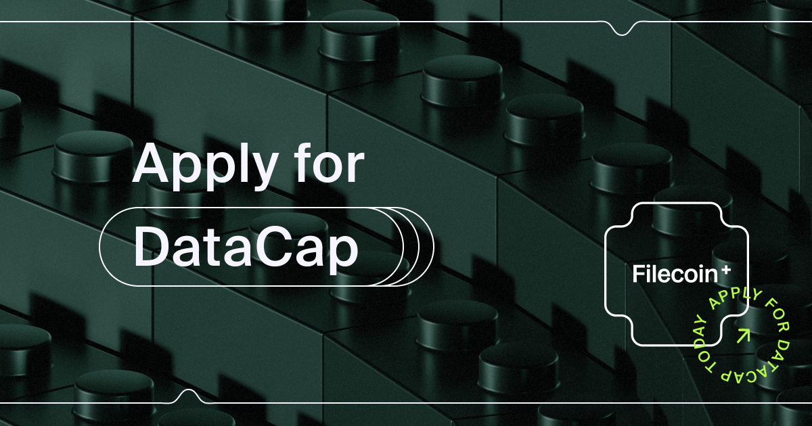

# Filecoin Plus
### [filplus.storage](https://filplus.storage)



***

The repository for the _[filplus.storage](https://filplus.storage)_ web app's frontend and backend. Filecoin Plus is a social layer mechanism that incentivizes all participants in the network to make Filecoin more useful. Filplus.storage is a service that aims to improve the experience of applying for DataCap, as well as learning about Filecoin Plus.

This is a monorepo with two workspaces, `fe` (frontend) and `be` (backend). It conforms to [npm's workspace architecture](https://docs.npmjs.com/cli/v7/using-npm/workspaces) (available in npm 7+).

The frontend is a collection SSR pages, built with Vue/Nuxt. Data is connected via backend endpoints.


## Build commands

For local development, or for initialization using a CI, use the following build commands. The backend and frontend packages should run concurrently. For local development, you'll want two shell sessions.

**Install**

```bash
npm ci
```

**Build Backend**

```bash
npm run dev-be
```

**Build Frontend**

```bash
npm run dev-fe
```


## Setup

1. Get env and crt files from a development lead, these will include these four files
    - `dpp-mongodb-client.pem`
    - `dpp-ca.crt`
    - `.env (for frontend)`
    - `.env (for backend)`
  - For `.env` file, make sure to change `<username>` to your own user (`whoami`)
  - `DPP_CA_PATH=/Users/<username>/.ssh/dpp-ca.crt`
  - `MONGODB_CLIENT_PEM=/Users/<username>/.ssh/dpp-mongodb-client.pem`

2. Add .env file to `/packages/fe`

3. Add .env file to `/packages/be`

4. Copy the certs to your `.ssh` like `cp -v dpp-ca.crt dpp-mongodb-client.pem ~/.ssh`

5. Add Self-signed certificate (see next section)


## Self-signed certificate

In order to use the site in local development mode, two files must be added to the repo's root directory. The following set of commands apply to a MacOS system, however, if `mkcert` is installed by another package manager, this can be run on any flavor of *nix. 

```zsh
cd ~/.ssh
brew install mkcert ## replace with another package manager for linux distro
mkcert -install
mkcert -key-file localhost_key.pem -cert-file localhost_cert.pem localhost 127.0.0.1
cat localhost_cert.pem > localhost_fullchain.pem
cat "$(mkcert -CAROOT)/rootCA.pem" >> localhost_fullchain.pem
```

Now, navigate to your project directory, wherever the repo was cloned to, for example `cd ~/Sites/work/website` and copy the `pem` files into the repo root. These keys are `.gitignored` by default.

```zsh
cp -v ~/.ssh/localhost_cert.pem ~/.ssh/localhost_key.pem .
```

