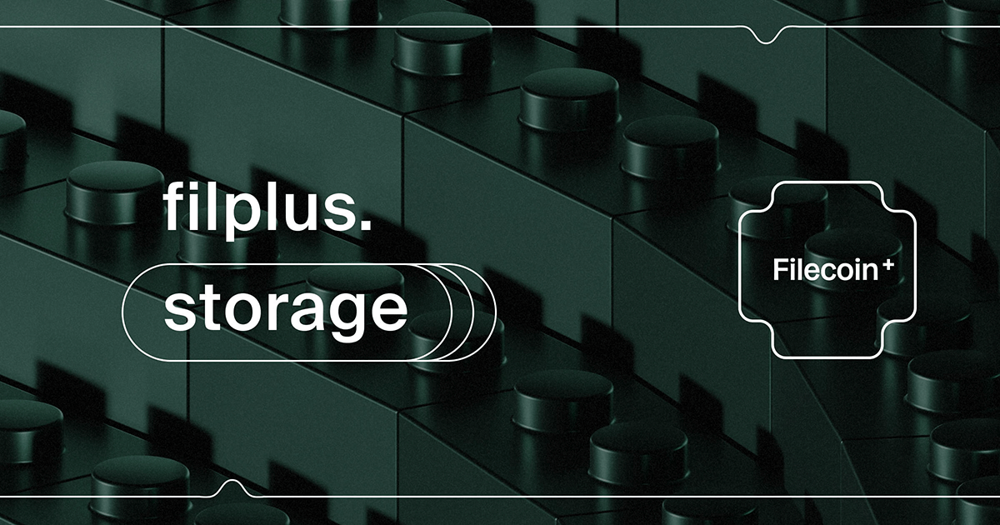

# Filecoin Plus
### [filplus.storage](https://filplus.storage)



***

The repository for the _[filplus.storage](https://filplus.storage)_ web app's frontend and backend. Filecoin Plus is a social layer mechanism that incentivizes all participants in the network to make Filecoin more useful. Filplus.storage is a service that aims to improve the experience of applying for DataCap, as well as learning about Filecoin Plus.

This is a monorepo with two workspaces, `fe` (frontend) and `be` (backend). It conforms to [npm's workspace architecture](https://docs.npmjs.com/cli/v7/using-npm/workspaces) (available in npm 7+).

The frontend is a collection SSR pages, built with Vue/Nuxt. Data is connected via backend endpoints.


## Build commands

For local development, or for initialization using a CI, use the following build commands. The backend and frontend packages should run concurrently. For local development, you'll want two shell sessions.

**Install**

```bash
npm ci
```

**Build Backend**

```bash
npm run dev-be
```

**Build Frontend**

```bash
npm run dev-fe
```

## Stack

- Requires nodeJS and has been tested on node 16
- Uses a Vue framework, [nuxtJS 2](https://nuxtjs.org/)
- Styles are written in SCSS, and are concatenated and tree-shaken during compile-time
- Content management is supported by `.json` files in `content/pages`, the content is abstracted to these files, but there's no conventional content management system


## Setup

1. Get env and crt files from a development lead, these will include these four files
    - `dpp-mongodb-client.pem`
    - `dpp-ca.crt`
    - `.env (for frontend)`
    - `.env (for backend)`
  - For `.env` file, make sure to change `<username>` to your own user (`whoami`)
  - `DPP_CA_PATH=/Users/<username>/.ssh/dpp-ca.crt`
  - `MONGODB_CLIENT_PEM=/Users/<username>/.ssh/dpp-mongodb-client.pem`

2. Add .env file to `/packages/fe`

3. Add .env file to `/packages/be`

4. Copy the certs to your `.ssh` like `cp -v dpp-ca.crt dpp-mongodb-client.pem ~/.ssh`

5. Add Self-signed certificate (see next section)


## Self-signed certificate

In order to use the site in local development mode, two files must be added to the repo's root directory. The following set of commands apply to a MacOS system, however, if `mkcert` is installed by another package manager, this can be run on any flavor of *nix. 

```zsh
cd ~/.ssh
brew install mkcert # replace with another package manager for linux distro
brew install nss # need to install certutil before running `mkcert -install` so the CA can be automatically installed in Firefox
# at this point, open any https website in Firefox before running the below commands
mkcert -install
mkcert -key-file localhost_key.pem -cert-file localhost_cert.pem localhost 127.0.0.1
cat localhost_cert.pem > localhost_fullchain.pem
cat "$(mkcert -CAROOT)/rootCA.pem" >> localhost_fullchain.pem
```

Now, navigate to your project directory, wherever the repo was cloned to, for example `cd ~/Sites/work/website` and copy the `pem` files into the repo root. These keys are `.gitignored` by default.

```zsh
cp -v ~/.ssh/localhost_cert.pem ~/.ssh/localhost_key.pem .
```

## Updating dependencies

Please use `npm ci` in place of `npm i` when not explicitly upgrading depdendencies. `npm ci` will only install versions of packages provided in the lockfile, leading to more stability. 

Always regression test the site if upgrading packages, as they may contain breaking changes.


## Commit Messages

Commit messages should use the [Conventional Commit](https://www.conventionalcommits.org/en/v1.0.0/) format. `commitlint` has been installed to validate this usage. This means that all commits should be prefixed appropriately with a tag denoting the kind of code being committed.

- `feat:` A feature, or part of a feature
- `fix:` A bug fix
- `style:` A visual or stylistic change only
- `chore:` An operational task, such as routine maintenance, version control related operations, dependencies, etc.
- `refactor:` A change to the way the code is implemented, without materially changing the feature
- `perf:` A change that is made primarily to improve performance
- `test:` Any changes required to run a specific test or try out a behavior for the purposes of testing
- `cleanup:` Markup and syntactic cleanup that doesn't affect the code output
- `docs:` Documentation-related changes
- `content:` Changes to the project's content, such as copy or media


## Style guide

1. All file names will be in `kebab-case`
2. All component names on import will be `PascalCase`
3. The grid used is a flexbox style system called [Gridlex](https://gridlex.devlint.fr/), its documentation is also available as a [readme in this repo](packages/site/assets/scss/grid/README.md)
4. Color name variables in `SCSS` are obtained from [this resource](https://chir.ag/projects/name-that-color/)


## Linting

_To be updated_

- ~~`npm run lint` runs `eslint` on all `.js` and `.vue` files~~
- ~~Linting runs automatically as a pre-commit hook~~
